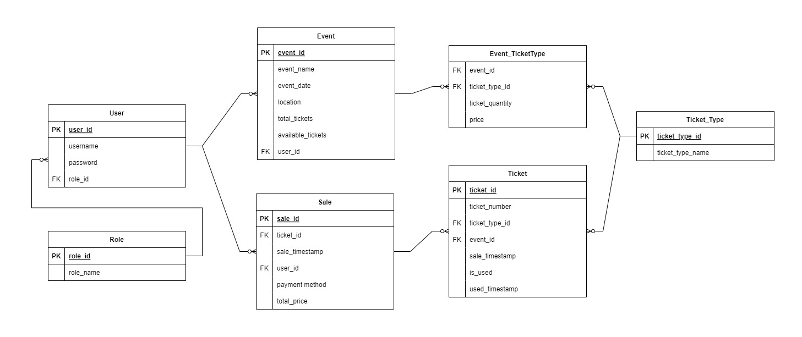

# TicketGuru

SCRUM-Ritarit

Tiimi: Miska Pöyry, Tuomas Sirviö, Hanna-Riikka Happonen, Roosa Karjalainen, Pekka Näätsaari, Jesse Ritola

## Johdanto

### Projektin aihe:
TicketGuru on lipunmyyntijärjestelmä, joka on suunniteltu lipputoimistolle. Sen pääasiallinen tarkoitus on mahdollistaa lippujen myynti ja tulostus myyntipisteessä. Järjestelmä mahdollistaa tapahtumien määrittämisen, lippujen myynnin sekä niiden käytön tarkastamisen ovella (paperiset liput sekä mobiililiput QR-koodilla).

### Asiakas:
Asiakkaamme on lipputoimisto, joka tarvitsee sähköisen järjestelmän lippujen myyntiin sekä hallintaan. Järjestelmä mahdollistaa lipunmyyjien myyvän ja tulostavan liput asiakkaille sekä hallitsevan lippujen jäljellä olevia määriä. Ennakkomyynnin jälkeen jääneet liput voidaan tulostaa ovella myytäviksi.

### Mitä asiakas saa järjestelmältä:
TicketGuru tarjoaa lipunmyyjille työkalut lipunmyyntiin, tulostukseen ja lipun tarkastukseen. Järjestelmässä on myös mahdollisuus määritellä tapahtumia ja niiden lippumääriä. Tulevaisuudessa järjestelmään aiotaan lisätä verkkokauppa, jonka kautta asiakkaat voivat itse ostaa lippuja.

### Toteutus- ja toimintaympäristö lyhyesti:

-   Palvelinpuolen ratkaisut ja teknologiat: SpringBoot, MariaDB
-   Käyttöliittymäratkaisut ja teknologiat: Desktop (Windows), Mobiililaitteet (Android ja iOS), React, Bootstrap

### Mitä valmiina, kun projekti päättyy?

Projektin päättyessä ovat valmiina seuraavat osa-alueet: lipunmyyntijärjestelmä, tapahtumien hallinta, lipun tulostus ja käytön tarkastaminen. Verkkokaupan integrointi on suunnitteilla seuraavaan vaiheeseen. Projektin päättyessä on valmiina myös kaikki tarvittava dokumentointi projektin kulusta ja siitä kaikesta mitä ollaan tehty. 

## Järjestelmän määrittely

### Käyttäjäryhmät (roolit):

#### Järjestelmän ylläpitäjä (lipputoimisto)
-   Lisää ja hallinnoi tapahtumia järjestelmässä
-   Luo ja tarvittaessa päivittää lipputyypit
-   Tuottaa myyntiraportteja mm. myynnin analysoimiseksi

#### Lipunmyyjä
-   Myy liput asiakkaille myyntipisteessä
-   Tulostaa liput asiakkaille ja ovella myytäviksi ennakkomyynnin jälkeen
-   Tarkastaa liput ovella (merkitään käytetyiksi)

### Käyttäjätarinat

#### Lipunmyyjä
-   Lipunmyyjänä haluan myydä ja tulostaa lippuja asiakkaille, että he voivat osallistua tapahtumaan.
-   Lipunmyyjänä haluan merkitä liput käytetyiksi ovella varmistuakseni, että vain maksaneet asiakkaat pääsevät osallistumaan tapahtumaan.
-   Lipunmyyjänä haluan tarkastella tulevia tapahtumia ja lipputilannetta, että voin etsiä ja tarjota sopivia vaihtoehtoja asiakkaille.
-   Lipunmyyjänä haluan, että järjestelmä on saatavilla 99,9 % ajasta, että voin myydä asiakkaille lippuja ja tarkastaa niitä ilman keskeytyksiä.
-   Lipunmyyjänä haluan, että lipun myyntitapahtuma kestää alle 2 sekuntia, että voin myydä lippuja nopeasti ilman asiakaspalvelun ruuhkautumista.

#### Järjestelmän ylläpitäjä
-   Järjestelmän ylläpitäjänä haluan lisätä järjestelmään uusia tapahtumia, että lippuja voidaan myydä tuleviin tapahtumiin.
-   Järjestelmän ylläpitäjänä haluan luoda ja muokata lipputyyppejä (esim. aikuinen, lapsi, opiskelija), että asiakkailla on sopivia hintavaihtoehtoja.
-   Järjestelmän ylläpitäjänä haluan luoda myyntiraportteja, että pysyn ajan tasalla myynnin tilasta ja siitä, minkälaiset tapahtumat kiinnostavat asiakkaita.
-   Järjestelmän ylläpitäjänä haluan, että tiedonhaku menneiden tapahtumien myyntitiedoista onnistuu muutamalla klikkauksella, että työaikaa ei mene hukkaan.
-   Järjestelmän ylläpitäjänä haluan, että vain ylläpitäjillä on pääsy lippujen ja tapahtumien ylläpitoon, että tietoturva toteutuu asianmukaisesti.

## Käyttöliittymä

### Käyttöliittymäkaavio

Tässä on alustava käyttöliittymäkaavio. Jokainen järjestelmän käyttäjä on velvoitettu kirjautumaan, jonka jälkeen peruskäyttäjän ja adminin käyttötapausten perusteella toiminta eroaa hiukan. Admin toimii siis ikään kuin hallinnoivana elimenä, eikä täten osallistu suoranaisesti lippujen myymiseen. Hän kuitenkin kykenee hallinnoimaan tapahtumia, tarkastelemaan sen tietoja (tilastoja) ja lisäämään uusia tapahtumia. Myyjä voi puolestaan myydä valitsemiaan lippuja valitsemaansa tapahtumaan, mikäli ne ovat vapaana. Hän myös vastaa lippujen tarkastamisesta ja niiden käytetyksi merkitsemisestä. Käyttöliittymäkaaviosta on alustavasti tarkasteltavissa tärkeimmät näkymät ja niiden väliset suhteet.

Admin tasoinen käyttäjä kykenee myös näkemään valitsemansa tapahtuman kaikki ostotapahtumat, klikkaamalla ostotapahtuman ID numeroa, jonka avulla hän kykenee näkemään kaikki kyseisellä ostotapahtumalla ostetut liput samanaikaisesti.

***Alapuolelle on luotu hahmotelmia, joiden avulla käyttöliittymään saadaan lisää selkeyttä. Huomioithan, että nämä eivät ole tässä vaiheessa vielä lopullisia, ja muutosten tullessa eteen, niitä voi käydä muuttamassa.***

### Kirjatuminen

Näyttöhahmotelma kirjautumisruutuun sekä rekisteröimiseen. Niiden välinen suhde tulee tosin miettiä, sillä kuka tahansa ei voi tehdä käyttäjää järjestelmään, vaan sitä on rajattava jollakin tavalla (admin käyttäjä hyväksyy/luo käyttäjät?).

### Lippujen myynti

Lipunmyynti on avoinna Myyjille ja siellä myyjä kykenee valitsemaan tapahtuman, lippujen määrän ja tyypin sekä tulostamaan liput ostamisen jälkeen.

### Hallinnointi

Hallinnointiin pääsee "admin" tasoisilla tunnuksilla. Siellä käyttäjä kykenee luomaan uuden tapahtuman, tarkastelemaan tapahtumia ja niiden menetystä tai muokkaamaan valitun tapahtuman tietoja.

### Lippujen tarkastus

Lippujen tarkastus vaatii myyjän roolin. Se toimii yksinkertaisesti syöttämällä käyttäjän antaman lipun hash koodi järjestelmään. Järjestelmä hakee lipun ja sen tiedot. Mikäli lippu on käyttökelpoinen kaikin puolin, voi myyjä tällöin merkitä sen käytetyksi.

### Kayttöliittymähahmotelmat

Hahmotelmat ovat löydettävissä ja muokattavissa [täältä](https://www.canva.com/design/DAGQ1kQ8OUA/b28P_8oSvLwuQQcILEEJBg/edit?utm_content=DAGQ1kQ8OUA&utm_campaign=designshare&utm_medium=link2&utm_source=sharebutton)

## Tietokanta

Järjestelmään säilöttävä ja siinä käsiteltävät tiedot ja niiden väliset suhteet
kuvataan käsitekaaviolla. Käsitemalliin sisältyy myös taulujen välisten viiteyhteyksien ja avainten
määritykset. Tietokanta kuvataan käyttäen jotain kuvausmenetelmää, joko ER-kaaviota ja UML-luokkakaaviota.

Lisäksi kukin järjestelmän tietoelementti ja sen attribuutit kuvataan
tietohakemistossa. Tietohakemisto tarkoittaa yksinkertaisesti vain jokaisen elementin (taulun) ja niiden
attribuuttien (kentät/sarakkeet) listausta ja lyhyttä kuvausta esim. tähän tyyliin:

### Tietokantakaavio

> ### _Tilit_
> _Tilit-taulu sisältää käyttäjätilit. Käyttäjällä voi olla monta tiliä. Tili kuuluu aina vain yhdelle käyttäjälle._
>
> Kenttä | Tyyppi | Kuvaus
> ------ | ------ | ------
> id | int PK | Tilin id
> nimimerkki | varchar(30) |  Tilin nimimerkki
> avatar | int FK | Tilin avatar, viittaus [avatar](#Avatar)-tauluun
> kayttaja | int FK | Viittaus käyttäjään [käyttäjä](#Kayttaja)-taulussa

## Tekninen kuvaus

Teknisessä kuvauksessa esitetään järjestelmän toteutuksen suunnittelussa tehdyt tekniset
ratkaisut, esim.

-   Missä mikäkin järjestelmän komponentti ajetaan (tietokone, palvelinohjelma)
    ja komponenttien väliset yhteydet (vaikkapa tähän tyyliin:
    https://security.ufl.edu/it-workers/risk-assessment/creating-an-information-systemdata-flow-diagram/)
-   Palvelintoteutuksen yleiskuvaus: teknologiat, deployment-ratkaisut yms.
-   Keskeisten rajapintojen kuvaukset, esimerkit REST-rajapinta. Tarvittaessa voidaan rajapinnan käyttöä täsmentää
    UML-sekvenssikaavioilla.
-   Toteutuksen yleisiä ratkaisuja, esim. turvallisuus.

Tämän lisäksi

-   ohjelmakoodin tulee olla kommentoitua
-   luokkien, metodien ja muuttujien tulee olla kuvaavasti nimettyjä ja noudattaa
    johdonmukaisia nimeämiskäytäntöjä
-   ohjelmiston pitää olla organisoitu komponentteihin niin, että turhalta toistolta
    vältytään

## Testaus

Tässä kohdin selvitetään, miten ohjelmiston oikea toiminta varmistetaan
testaamalla projektin aikana: millaisia testauksia tehdään ja missä vaiheessa.
Testauksen tarkemmat sisällöt ja testisuoritusten tulosten raportit kirjataan
erillisiin dokumentteihin.

Tänne kirjataan myös lopuksi järjestelmän tunnetut ongelmat, joita ei ole korjattu.

## Asennustiedot

Järjestelmän asennus on syytä dokumentoida kahdesta näkökulmasta:

-   järjestelmän kehitysympäristö: miten järjestelmän kehitysympäristön saisi
    rakennettua johonkin toiseen koneeseen

-   järjestelmän asentaminen tuotantoympäristöön: miten järjestelmän saisi
    asennettua johonkin uuteen ympäristöön.

Asennusohjeesta tulisi ainakin käydä ilmi, miten käytettävä tietokanta ja
käyttäjät tulee ohjelmistoa asentaessa määritellä (käytettävä tietokanta,
käyttäjätunnus, salasana, tietokannan luonti yms.).

## Käynnistys- ja käyttöohje

Tyypillisesti tässä riittää kertoa ohjelman käynnistykseen tarvittava URL sekä
mahdolliset kirjautumiseen tarvittavat tunnukset. Jos järjestelmän
käynnistämiseen tai käyttöön liittyy joitain muita toimenpiteitä tai toimintajärjestykseen liittyviä asioita, nekin kerrotaan tässä yhteydessä.

Usko tai älä, tulet tarvitsemaan tätä itsekin, kun tauon jälkeen palaat
järjestelmän pariin !
