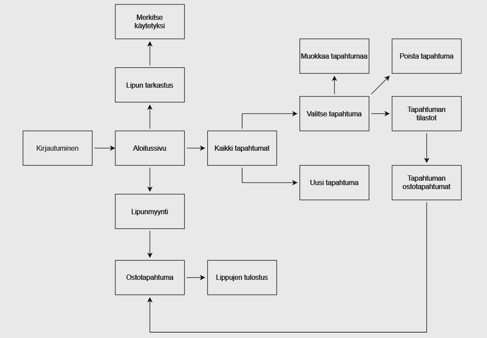
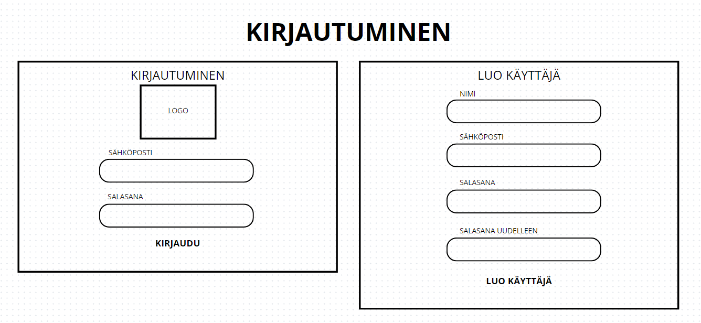
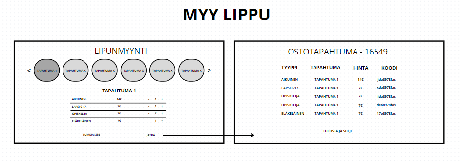
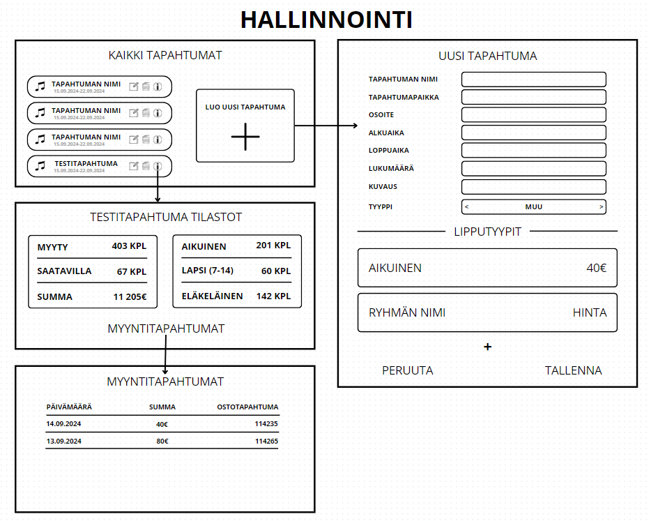
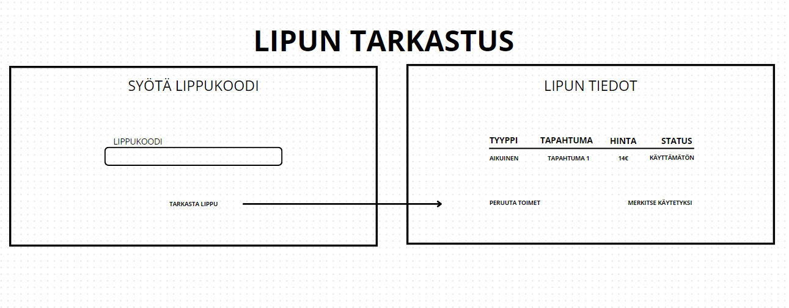
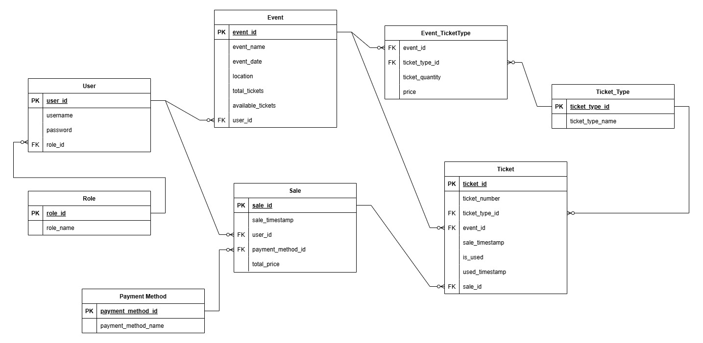
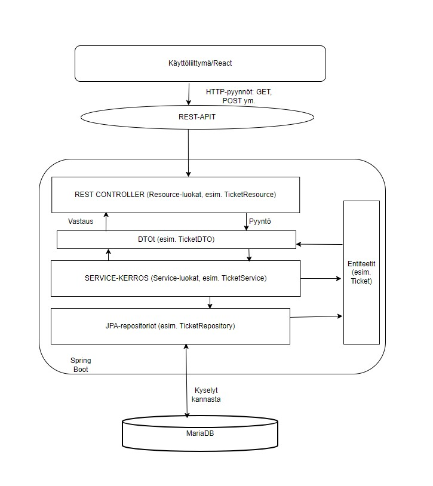

# TicketGuru

SCRUM-Ritarit

Tiimi: Miska Pöyry, Tuomas Sirviö, Hanna-Riikka Happonen, Roosa Karjalainen, Pekka Näätsaari, Jesse Ritola

## Johdanto

### Projektin aihe:
TicketGuru on lipunmyyntijärjestelmä, joka on suunniteltu lipputoimistolle. Sen pääasiallinen tarkoitus on mahdollistaa lippujen myynti ja tulostus myyntipisteessä. Järjestelmä mahdollistaa tapahtumien määrittämisen, lippujen myynnin sekä niiden käytön tarkastamisen ovella (paperiset liput sekä mobiililiput QR-koodilla).

### Asiakas:
Asiakkaamme on lipputoimisto, joka tarvitsee sähköisen järjestelmän lippujen myyntiin sekä hallintaan. Järjestelmä mahdollistaa lipunmyyjien myyvän ja tulostavan liput asiakkaille sekä hallitsevan lippujen jäljellä olevia määriä. Ennakkomyynnin jälkeen jääneet liput voidaan tulostaa ovella myytäviksi.

### Mitä asiakas saa järjestelmältä:
TicketGuru tarjoaa lipunmyyjille työkalut lipunmyyntiin, tulostukseen ja lipun tarkastukseen. Järjestelmässä on myös mahdollisuus määritellä tapahtumia ja niiden lippumääriä. Tulevaisuudessa järjestelmään aiotaan lisätä verkkokauppa, jonka kautta asiakkaat voivat itse ostaa lippuja.

### Toteutus- ja toimintaympäristö lyhyesti:

-   Palvelinpuolen ratkaisut ja teknologiat: SpringBoot, MariaDB
-   Käyttöliittymäratkaisut ja teknologiat: Desktop (Windows), React, Bootstrap

### Mitä valmiina, kun projekti päättyy?

Projektin päättyessä ovat valmiina seuraavat osa-alueet: lipunmyyntijärjestelmä, tapahtumien hallinta, lipun tulostus ja käytön tarkastaminen. Verkkokaupan integrointi on suunnitteilla seuraavaan vaiheeseen. Projektin päättyessä on valmiina myös kaikki tarvittava dokumentointi projektin kulusta ja siitä kaikesta mitä ollaan tehty. 

## Järjestelmän määrittely

### Käyttäjäryhmät (roolit):

#### Järjestelmän ylläpitäjä (lipputoimisto)
-   Lisää ja hallinnoi tapahtumia järjestelmässä
-   Luo ja tarvittaessa päivittää lipputyypit
-   Tuottaa myyntiraportteja mm. myynnin analysoimiseksi

#### Lipunmyyjä
-   Myy liput asiakkaille myyntipisteessä
-   Tulostaa liput asiakkaille ja ovella myytäviksi ennakkomyynnin jälkeen
-   Tarkastaa liput ovella (merkitään käytetyiksi)

### Käyttäjätarinat

#### Lipunmyyjä
-   Lipunmyyjänä haluan myydä ja tulostaa lippuja asiakkaille, että he voivat osallistua tapahtumaan.
-   Lipunmyyjänä haluan merkitä liput käytetyiksi ovella varmistuakseni, että vain maksaneet asiakkaat pääsevät osallistumaan tapahtumaan.
-   Lipunmyyjänä haluan tarkastella tulevia tapahtumia ja lipputilannetta, että voin etsiä ja tarjota sopivia vaihtoehtoja asiakkaille.
-   Lipunmyyjänä haluan, että lipun myyntitapahtuma kestää alle 2 sekuntia, että voin myydä lippuja nopeasti ilman asiakaspalvelun ruuhkautumista.

#### Järjestelmän ylläpitäjä
-   Järjestelmän ylläpitäjänä haluan lisätä järjestelmään uusia tapahtumia, että lippuja voidaan myydä tuleviin tapahtumiin.
-   Järjestelmän ylläpitäjänä haluan luoda ja muokata lipputyyppejä (esim. aikuinen, lapsi, opiskelija), että asiakkailla on sopivia hintavaihtoehtoja.
-   Järjestelmän ylläpitäjänä haluan luoda myyntiraportteja, että pysyn ajan tasalla myynnin tilasta ja siitä, minkälaiset tapahtumat kiinnostavat asiakkaita.
-   Järjestelmän ylläpitäjänä haluan, että tiedonhaku menneiden tapahtumien myyntitiedoista onnistuu muutamalla klikkauksella, että työaikaa ei mene hukkaan.
-   Järjestelmän ylläpitäjänä haluan, että vain ylläpitäjillä on pääsy lippujen ja tapahtumien ylläpitoon, että tietoturva toteutuu asianmukaisesti.

## Käyttöliittymä

### Käyttöliittymäkaavio

Tässä on alustava käyttöliittymäkaavio. Jokainen järjestelmän käyttäjä on velvoitettu kirjautumaan, jonka jälkeen peruskäyttäjän ja adminin käyttötapausten perusteella toiminta eroaa hiukan. Admin toimii siis ikään kuin hallinnoivana elimenä, eikä täten osallistu suoranaisesti lippujen myymiseen. Hän kuitenkin kykenee hallinnoimaan tapahtumia, tarkastelemaan sen tietoja (tilastoja) ja lisäämään uusia tapahtumia. Myyjä voi puolestaan myydä valitsemiaan lippuja valitsemaansa tapahtumaan, mikäli ne ovat vapaana. Hän myös vastaa lippujen tarkastamisesta ja niiden käytetyksi merkitsemisestä. Käyttöliittymäkaaviosta on alustavasti tarkasteltavissa tärkeimmät näkymät ja niiden väliset suhteet.

Admin tasoinen käyttäjä kykenee myös näkemään valitsemansa tapahtuman kaikki ostotapahtumat, klikkaamalla ostotapahtuman ID numeroa, jonka avulla hän kykenee näkemään kaikki kyseisellä ostotapahtumalla ostetut liput samanaikaisesti.

***Alapuolelle on luotu hahmotelmia, joiden avulla käyttöliittymään saadaan lisää selkeyttä. Huomioithan, että nämä eivät ole tässä vaiheessa vielä lopullisia, ja muutosten tullessa eteen, niitä voi käydä muuttamassa.***

### Kirjautuminen

Näyttöhahmotelma kirjautumisruutuun sekä rekisteröimiseen. Niiden välinen suhde tulee tosin miettiä, sillä kuka tahansa ei voi tehdä käyttäjää järjestelmään, vaan sitä on rajattava jollakin tavalla (admin käyttäjä hyväksyy/luo käyttäjät?).

### Lippujen myynti

Lipunmyynti on avoinna Myyjille ja siellä myyjä kykenee valitsemaan tapahtuman, lippujen määrän ja tyypin sekä tulostamaan liput ostamisen jälkeen.

### Hallinnointi

Hallinnointiin pääsee "admin" tasoisilla tunnuksilla. Siellä käyttäjä kykenee luomaan uuden tapahtuman, tarkastelemaan tapahtumia ja niiden menetystä tai muokkaamaan valitun tapahtuman tietoja.

### Lippujen tarkastus

Lippujen tarkastus vaatii myyjän roolin. Se toimii yksinkertaisesti syöttämällä käyttäjän antaman lipun hash koodi järjestelmään. Järjestelmä hakee lipun ja sen tiedot. Mikäli lippu on käyttökelpoinen kaikin puolin, voi myyjä tällöin merkitä sen käytetyksi.

### Kayttöliittymähahmotelmat

Hahmotelmat ovat löydettävissä ja muokattavissa [täältä](https://www.canva.com/design/DAGQ1kQ8OUA/b28P_8oSvLwuQQcILEEJBg/edit?utm_content=DAGQ1kQ8OUA&utm_campaign=designshare&utm_medium=link2&utm_source=sharebutton)

## Tietokanta

Tietokanta on suunniteltu tukemaan käyttäjien, tapahtumien ja lippujen hallintaa tehokkaasti ja joustavasti. Seuraavaksi esitetään tietohakemisto, joka sisältää tärkeimmät taulut, niiden kentät ja kuvaus niiden käyttötarkoituksesta. Ohessa on myös ER-kaavio, joka havainnollistaa tietokannan rakennetta ja suhteita eri taulujen välillä. 

### Tietokantakaavio

### Tietohakemisto

> ### _app_user_
> _user-taulu sisältää käyttäjätilin tiedot. Tili kuuluu aina vain yhdelle käyttäjälle._

> Kenttä | Tyyppi | Kuvaus
> ------ | ------ | ------
> user_id | BIGINT PK NOT NULL AUTO_INCREMENT | Käyttäjän yksilöivä tunniste
> role_id | BIGINT FK NOT NULL | Roolin tunniste (viittaus role-tauluun)
> username | VARCHAR (255) NOT NULL UNIQUE |  Käyttäjän käyttäjätunnus
> passwordhash | VARCHAR (255)  NOT NULL | Käyttäjän salasana

> ### _role_
> _rooli-taulu sisältää roolien tiedot. Yhdellä käyttäjällä voi olla vain yksi rooli._

> Kenttä | Tyyppi | Kuvaus
> ------ | ------ | ------
> role_id | BIGINT PK NOT NULL AUTO_INCREMENT | Roolin yksilöivä tunniste
> role_name | VARCHAR NOT NULL |  Roolin nimi

> ### _event_
> _event-taulu sisältää yksittäisen tapahtuman tiedot._
>
> Kenttä | Tyyppi | Kuvaus
> ------ | ------ | ------
> event_id | BIGINT PK NOT NULL AUTO_INCREMENT | Tapahtuman yksilöivä tunniste
> user_id | BIGINT FK NOT NULL | Käyttäjä, joka on luonut tapahtuman (viittaus tauluun app_user)
> event_name | VARCHAR (255) NOT NULL |  Tapahtuman nimi
> event_date | TIMESTAMP NOT NULL | Tapahtuman päivämäärä ja aika
> location | VARCHAR (255) NOT NULL | Tapahtuman sijainti
> total_tickets | INT NOT NULL | Lippujen määrä tapahtumassa kaikkiaan
> available_tickets | INT NOT NULL| Saatavilla olevien lippujen määrä tapahtumassa

> ### _ticket_type_
> _ticket_type -taulu sisältää lipputyyppien tiedot._

> Kenttä | Tyyppi | Kuvaus
> ------ | ------ | ------
> ticket_type_id | BIGINT PK NOT NULL AUTO_INCREMENT | Lipputyypin yksilöivä tunniste
> ticket_type_name | VARCHAR (255) NOT NULL| Lipputyypin nimi (esim. "aikuinen" tai "lapsi")

> ### _event_ticket_type_
> _event_ticket_type-taulu yhdistää tapahtumat ja lipputyypit mahdollistaen erilaisten lippujen hallinnan tapahtumakohtaisesti. Taulu tallentaa tiedot tietyn lipputyypin saatavuudesta ja määrästä kullekin tapahtumalle sekä lipputyypin hinnan._

> Kenttä | Tyyppi | Kuvaus
> ------ | ------ | ------
> event_ticket_type_id | BIGINT PK NOT NULL AUTO_INCREMENT | Event ticket typen yksilöivä tunniste
> ticket_type_id | BIGINT FK NOT NULL | Lipputyyppi (viittaus tauluun ticket_type)
> event_id | BIGINT FK NOT NULL | Tapahtuma (viittaus tauluun event)
> ticket_quantity | INT NOT NULL |  Saatavilla oleva määrä tietylle lipputyypille
> price | DECIMAL (10, 2) NOT NULL|  Lipun hinta

> ### _ticket_
> _ticket-taulu sisältää yksittäisen lipun tiedot._

> Kenttä | Tyyppi | Kuvaus
> ------ | ------ | ------
> ticket_id | BIGINT PK NOT NULL AUTO_INCREMENT | Lipun yksilöivä tunniste
> ticket_number | VARCHAR (255) NOT NULL | Lipun numero tai tunniste
> ticket_type_id | BIGINT FI NOT NULL | Lipputyyppi (viittaus tauluun ticket_type)
> event_id | BIGINT FK NOT NULL | Tapahtuma (viittaus tauluun event)
> sale_id | BIGINT FK NOT NULL | Myyntitapahtuman id (viittaus tauluun sale)
> sale_timestamp | TIMESTAMP NOT NULL | Lipun myyntiaika
> is_used | TINYINT NOT NULL | Lipun käyttötilanne
> used_timestamp | TIMESTAMP | Ajankohta, jolloin lippu on käytetty (null, jos ei ole käytetty)

> ### _sale_
> _sale-taulu sisältää yksittäisen myyntitapahtuman tiedot._

> Kenttä | Tyyppi | Kuvaus
> ------ | ------ | ------
> sale_id | BIGINT PK NOT NULL AUTO_INCREMENT | Myyntitapahtuman yksilöivä tunniste
> sale_timestamp | TIMESTAMP NOT NULL | Myyntitapahtuman ajankohta
> user_id | BIGINT FK | Myynnin suorittanut käyttäjä (viittaus tauluun app_user)
> payment_method_id | BIGINT FK | Maksutapa (viittaus tauluun payment_method)
> total_price | DECIMAL (10, 2) | Myynnin kokonaissumma

> ### _payment_method_
> _payment_method -taulu sisältää maksutapatyyppien tiedot._

> Kenttä | Tyyppi | Kuvaus
> ------ | ------ | ------
> payment_method_id | BIGINT PK NOT NULL AUTO_INCREMENT | Maksutavan yksilöivä tunniste
> payment_method_name | VARCHAR (255) | Maksutavan nimi (esim. "Credit card" tai "Cash")

## Tekninen kuvaus

### Kerrosarkkitehtuuri

- Frontend (käyttöliittymä): Frontendin kehityksessä on käytetty Reactia, TypeScriptiä ja Viteä, jotka yhdessä mahdollistavat tehokkaan ja dynaamisen käyttöliittymän rakentamisen. Käyttöliittymässä hyödynnetään Reactstrapia ja Bootstrapia ulkoasun ja responsiivisuuden hallintaan. Asynkroniset HTTP-pyynnöt toteutetaan Axiosilla.
- Backend (sovelluslogiikka): Spring Boot -sovellus, joka pyörii Rahti2-palvelimella.
- Tietokanta: MariaDB, joka sijaitsee Rahti2-palvelimella.

#### Sovelluksen rakenne

Sovellus noudattaa kerrosarkkitehtuuria, jossa web-kerros (Resource-luokat) kommunikoi service-kerroksen kanssa liiketoimintalogiikan käsittelemiseksi. Service-kerros kommunikoi tietokerroksen (repositorioiden) kanssa tietojen hakemiseksi tai tallentamiseksi. API:n ja tietokantarakenteen irrottamiseksi käytetään Data Transfer Objecteja (DTO), jotka siirtävät tietoa kerrosten välillä.

Resource-luokat käsittelevät saapuvia HTTP-pyyntöjä ja välittävät liiketoimintalogiikan palvelukerrokseen (eli Service-luokille).

DTOt: Käytetään siirtämään vain tarvittavat tiedot asiakkaalle. Esimerkiksi TicketDTO palauttaa lipun tiedoista kevyen vastauksen, joka sisältää riittävät lipun tiedot.

Entiteetit: Edustavat tietomallia tietokannassa. Esimerkiksi Ticket edustaa lipun entiteettiä tietokannassa, ja se muutetaan vastauksessa TicketDTO:ksi.

### Tietokantayhteys

TicketGuru käyttää MariaDB-tietokantaa, joka sijaitsee osoitteessa 172.30.223.252 ja portissa 3306. Tietokannan nimi on ticketguru. JDBC-ajurina käytetään MariaDB:n virallista ajuria. Yhteyskonfiguraatio määritellään Spring Bootin application-prod.properties-tiedostossa, ja käyttäjätunnukset haetaan turvallisesti ympäristömuuttujista.

### Tietokantamuutosten hallinta
Tietokannan rakenteen muutokset hallitaan Liquibase-työkalun avulla. Tietokannan nykyinen tila ja tarvittavat muutokset määritellään db.master.xml-changelog-tiedostossa, joka ohjaa yksittäisten muutostiedostojen käyttöä.

### Hibernate ja JPA
Tietokantakyselyt suoritetaan Spring Bootin JPA- ja Hibernate-kirjastojen avulla. Hibernate säilyttää Java-koodissa määritellyt entiteettien nimet muuttumattomina tietokannan puolella. Lokitiedostoihin kirjataan kaikki suoritettavat SQL-kyselyt kehityksen ja virheenkorjauksen helpottamiseksi.

### Palvelintoteutuksen yleiskuvaus

- Backend: Spring Boot -sovellus, joka toimii RESTful API:n välityksellä. 
- Frontend: React-sovellus
- Tietokanta: MariaDB/relaatiotietokanta. Spring Data JPA:n avulla käsitellään tietokannan kyselyjä. Liquibase huolehtii tietokannan rakenteellisten muutosten hallinnasta.

### Deployment-ratkaisut

Dovellus deployataan käyttäen Docker-kontteja ja suoritetaan Rahti2-palvelimella, joka on Kubernetes-pohjainen alusta. Dockerfile määrittelee sovelluksen rakennus- ja suoritusympäristön.

Dockerfile rakentaa TicketGuru-sovelluksen kahdessa vaiheessa: ensin builder-vaiheessa sovellus käännetään käyttäen Mavenia ja valmiit riippuvuudet kerätään offline-tilassa. Tämän jälkeen runtime-vaiheessa käytetään kevyttä JRE-kuvaa, johon kopioidaan valmiiksi rakennettu .jar-tiedosto. Lopuksi kontti määritellään käynnistämään sovellus Spring Bootin oletusportissa 8080. Tämä kaksivaiheinen rakenne optimoi kuvan koon ja parantaa suorituskykyä tuotantoympäristössä.

Sovellus käyttää ympäristömuuttujia ${DB_USER} ja ${DB_PASSWORD} tietokannan käyttäjänimen ja salasanan hallintaan. Tämä mahdollistaa arkaluonteisten tietojen erottamisen konfiguraatiotiedostoista ja eri asetusten käytön eri ympäristöissä. Ympäristömuuttujat määritellään ajonaikaisessa ympäristössä, ja ne lisäävät turvallisuutta, koska tietoja ei kovakoodata koodiin tai tallenneta versionhallintaan.

### Rajapintojen kuvaus

Rajapinnat toteutetaan RESTful API-rajapintoina. [Täydellinen API-dokumentaatio löytyy täältä.](APIDocumentaatio.md)

### Autentikointi ja auktorisointi

Sovellus käyttää Spring Securityä autentikointiin ja auktorisointiin. Käyttäjätiedot haetaan sovelluksen CustomUserDetailsService-palvelun kautta, joka lataa käyttäjät sovelluksen tietokannasta. Salasanat tallennetaan tietokantaan BCrypt-algoritmilla hajautettuna.

Autentikointi suoritetaan "TicketGuru"-realmissa, ja epäonnistunut autentikointi palauttaa HTTP 401 Unauthorized -vastauksen. Salasanat tarkistetaan BCryptPasswordEncoder-komponentin avulla.

Käyttöoikeudet perustuvat rooleihin, joita ovat ADMIN eli järjestelmänvalvojat ja USER eli tavalliset käyttäjät. Käyttäjiä hallitaan /api/users/**-resurssilla, mutta vain ADMIN-käyttäjät voivat käyttää tätä resurssia. Käyttäjätilit sisältävät roolin, joka määrittää käyttöoikeuksien laajuuden. Vain tiettyjen resurssien ja metodien käyttö on sallittu USER-tasoisille käyttäjille.Resurssipyyntöjen oikeudet määritellään [API-dokumentaatiossa](APIDocumentaatio.md) kohdassa Endpoint Access Control.

CSRF-suojaus on poistettu käytöstä, sillä sovellus käyttää ensisijaisesti API-pohjaista kommunikointia. Kaikki pyyntöoikeudet määritellään tarkasti URL-pohjaisilla reitityksillä ja mainituilla roolipohjaisilla säännöillä. 

Sovelluksessa on määritelty CORS-konfiguraatio, joka sallii pyynnöt paikallisesta kehitysympäristöstä (http://localhost:5173 ja http://localhost:8080) ja palvelimen osoitteesta https://ticket-guru-ticketguru-scrum-ritarit.2.rahtiapp.fi. Sovellus sallii credentials-tiedot, kuten evästeet ja Basic Auth -tunnisteet.

### Virheenkäsittely ja lokitus

Virheelliset API-pyynnöt palauttavat HTTP-virhekoodin (esim. 400 Bad Request) ja virheilmoituksen JSON-muodossa.

Lokitusmekanismina on Spring Bootin Logback (perusasetusten mukainen oletuslokitusmekanismi). Hibernate-kyselyt tulostetaan konsoliin.

## Testaus

Sovellukseen on tehty yksikkötestejä (JUnit) joihinkin service-kerroksen luokkiin sekä integraatiotestejä joihinkin web-kerroksen luokkiin. Kokonaisvaltaista testausta ei aikataulusyiden ja rajallisten resurssien takia pystytty tekemään. Alla tarkempi erittely siitä, mitä luokkia testattiin.

### Testattavat kohteet (JUnit-yksikkötestit)

- **AppUserService-luokka**: Testit keskittyvät AppUserService-luokan toimintoihin eli käyttäjien luomiseen, päivittämiseen, hakemiseen ja poistamiseen. Tavoitteena on varmistaa, että AppUserService toimii odotetusti ja että mahdolliset virhetilanteet käsitellään oikein.

- **SaleService-luokka**: Testit keskittyvät SaleService-luokan toimintoihin eli myyntitapahtumien käsittelyyn, kuten myynnin luomiseen, päivittämiseen, hakemiseen ja poistamiseen. Tavoitteena on varmistaa, että SaleService toimii odotetusti, ja että virhetilanteet käsitellään oikein.

#### Miten testit toteutettiin?

Testeissä keskittyttiin yksittäisten metodien käyttäytymiseen. Yksikkötesteissä palvelun toiminnallisuus on eristettyä ja testejä suoritetaan ilman, että tarvitaan tietokantaa tai muita ulkoisia resursseja.

Testien suorittamiseen on käytetty mock-objekteja ja Mockito-kirjastoa, joiden avulla voidaan simuloida ulkoisia riippuvuuksia, kuten tietokantakutsuja ja salasanan enkoodauksen logiikkaa.

### Testattavat kohteet (Integraatiotestit)

- **TicketResource-luokka:** Testit keskittyvät lipunhallinnan toimintoihin eli lippujen hakemiseen ja lipun merkitsemiseen käytetyksi. Tämä on ensimmäinen luokka, jolle kirjoitettiin integraatiotesti, joten luokka sisältää myös testin Liquibase-konfiguraatioiden tarkastamiseen. Tavoitteena on varmistaa, että liput voidaan hakea oikein ja että lipun käyttötilan päivittäminen toimii odotetusti.

- **SaleResource-luokka:** Testit keskittyvät Sale-resurssin integraatioon, joka käsittelee myyntitapahtumia, kuten myynnin luomista, hakemista, poistamista ja hakemista eri hakuehdoilla. Tavoitteena on varmistaa, että API toimii odotetusti ja virhetilanteet käsitellään oikein.

- **AppUserResource-luokka:** Testit keskittyvät AppUserResource-luokan käyttäjätoimintojen integroituun testaamiseen, eli varmistetaan, että käyttäjien luominen, päivittäminen, hakeminen ja poistaminen toimivat oikein todellisessa ympäristössä. Testeissä varmistetaan, että järjestelmä käsittelee odotetusti sekä onnistuneita että virheellisiä pyyntöjä API-kutsujen kautta. Testeissä otetaan huomioon myös mahdolliset virhetilanteet, kuten puuttuvat käyttäjät ja virheelliset syötteet.

- **EventResource-luokka:** Testit keskittyvät EventResource-luokan toimintoihin, jotka käsittelevät tapahtumien hakemista, luomista, päivittämistä ja virhetilanteita. Tavoitteena on varmistaa, että EventResource toimii odotetusti ja että tapahtumien käsittelyä varten tehdyt HTTP-pyynnöt tuottavat oikeat vastaukset.

#### Miten testit toteutettiin?

Halusimme testata palvelujen toimintaa kokonaisuutena, sisältäen API-pyyntöjen lähettämisen ja tietokannan kanssa kommunikoimisen. Nämä testit eivät rajoitu vain yksittäisiin metodeihin, vaan ne varmistavat, että sovelluksen eri osat toimivat yhteen ja kommunikoivat oikein.

Testit suoritetaan MockMvc-kirjaston avulla, joka simuloi HTTP-pyyntöjä ja vastaanottaa vastauksia ilman, että tarvitaan oikeaa käyttäjää tai käyttöliittymää. MockMvc-objekti suorittaa API-pyynnöt ja tarkistaa vastauksia käyttäen HTTP-statuskoodeja ja JSON-vastausten sisältöä. Näin varmistetaan, että API-toiminnallisuus on oikea, ja että se palauttaa oikeat virheviestit virheellisissä tilanteissa.

Testin konfiguraatiot on suoritettu application-test.properties-tiedostossa, jossa on määritelty, että testeissä käytetään ajonaikaista H2-kantaa. Kaikkien toiminnallisuuksien onnistumiseksi testeihin on määritelty, että siitä huolimatta käytetään MariaDB-dialectiä. Tietokannan skeemaa hallinnoidaan Liquibasessa, jossa sijaitsee myös testeissä käytettävä testidata.

Testeissä ei testata lainkaan auktorisointia, ja se onkin kytketty pois päältä erillisessä TestSecurityConfig-luokassa, jota testit käyttävät.

### Testattavat kohteet (End to End -testit)

Testattavat kohteet on valittu ohjelmiston alkuperäisten käyttäjätarinoiden pohjalta. Testasimme muun muassa:

- Sisäänkirjautumista
- Admin-oikeuksia
- Tapahtumien tarkastelua, hakua ja muokkaamista
- Lipun myyntiä, tulostamista ja tarkastusta
- Tapahtuman lisäämistä

#### Miten testit toteutettiin?

End to end -testit toteutettiin manuaalisesti ja testeistä luotiin excel-taulukko. Excel-taulukon löydät muutettuna md-taulukoksi erillisestä testausdokumentaatiosta, jonne ohjataan alempana.

### Erillinen testausdokumentaatio

Löydät tarkemman dokumentaation testauksesta ja sen tuloksista [täältä](TestausDokumentaatio.md).

## Asennustiedot

Järjestelmän asennus on syytä dokumentoida kahdesta näkökulmasta:

-   järjestelmän kehitysympäristö: miten järjestelmän kehitysympäristön saisi
    rakennettua johonkin toiseen koneeseen

-   järjestelmän asentaminen tuotantoympäristöön: miten järjestelmän saisi
    asennettua johonkin uuteen ympäristöön.

Asennusohjeesta tulisi ainakin käydä ilmi, miten käytettävä tietokanta ja
käyttäjät tulee ohjelmistoa asentaessa määritellä (käytettävä tietokanta,
käyttäjätunnus, salasana, tietokannan luonti yms.).

## Käynnistys- ja käyttöohje

Sovellus pyörii Rahti2-palvelimella osoitteessa: https://scrum-ritarit-frontend-ticketguru-scrum-ritarit.2.rahtiapp.fi/.

Käyttöliittymä ohjaa automaattisesti kirjautumiseen.

Tässä **user**-tasoisen käyttäjän tunnukset:

>**Username:** *user*

>**Password:** *user*

Tässä **admin**-tasoisen käyttäjän tunnukset:

>**Username:** *admin*

>**Password:** *admin*

**Huomaathan, että frontend on yhdistettynä rahdissa julkaistuun MariaDB:hen, joten muutokset tulevat siis sinne!**

Tyypillisesti tässä riittää kertoa ohjelman käynnistykseen tarvittava URL sekä
mahdolliset kirjautumiseen tarvittavat tunnukset. Jos järjestelmän
käynnistämiseen tai käyttöön liittyy joitain muita toimenpiteitä tai toimintajärjestykseen liittyviä asioita, nekin kerrotaan tässä yhteydessä.

Usko tai älä, tulet tarvitsemaan tätä itsekin, kun tauon jälkeen palaat
järjestelmän pariin !
